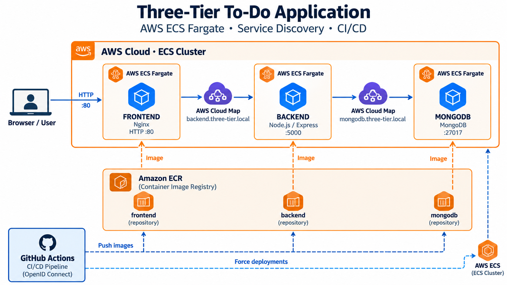

# 🚀 Three-Tier To-Do Application on AWS

A containerized three-tier To-Do application deployed on AWS using Amazon ECS with AWS Fargate. The project demonstrates Docker containerization, cloud deployment, AWS service discovery, CI/CD automation, and communication between the frontend, backend, and database layers.

---

# 📌 Project Overview

This project is a three-tier To-Do web application consisting of three main layers:

- **Presentation Layer:** HTML, JavaScript and Nginx
- **Application Layer:** Node.js and Express.js
- **Data Layer:** MongoDB

The complete application is containerized using Docker and deployed on Amazon ECS using AWS Fargate.

GitHub Actions is used to automate the CI/CD pipeline. Whenever changes are pushed to the `main` branch, the workflow builds the Docker images, pushes them to Amazon ECR, and triggers a new ECS deployment.

AWS Cloud Map is used for service discovery so that the frontend and backend communicate using stable private DNS names instead of depending on changing public IP addresses.

---

# 🎯 Project Objectives

The main objectives of this project are:

- Build a three-tier web application.
- Containerize each application component using Docker.
- Deploy the application using Amazon ECS and AWS Fargate.
- Store Docker images in Amazon ECR.
- Implement service discovery using AWS Cloud Map.
- Configure Nginx as a reverse proxy.
- Establish communication between frontend, backend and MongoDB.
- Implement automated CI/CD using GitHub Actions.
- Use GitHub OIDC for secure AWS authentication.
- Test and verify the complete deployed application.

---

# ✨ Application Features

The application provides the following functionality:

- Add a new task.
- Display existing tasks.
- Mark tasks as completed.
- Store tasks permanently in MongoDB.
- Retrieve tasks through the backend API.
- Access backend APIs through the Nginx reverse proxy.
- Maintain task data after refreshing the page.

---

# 🛠️ Technology Stack

## Application Technologies

- HTML
- JavaScript
- Nginx
- Node.js
- Express.js
- Mongoose
- MongoDB

## Containerization

- Docker
- Docker Compose

## AWS Services

- Amazon ECS
- AWS Fargate
- Amazon ECR
- AWS Cloud Map
- Amazon VPC
- AWS IAM
- Security Groups
- Route 53 Resolver

## CI/CD

- GitHub
- GitHub Actions
- GitHub OIDC
- AWS IAM Role

---

# 🏗️ System Architecture



The application follows a three-tier architecture:

```text
                         USER
                           |
                           v
                  +----------------+
                  |    Frontend    |
                  |  Nginx : 80    |
                  +----------------+
                           |
                           | /api/tasks
                           v
                  +----------------+
                  |   AWS Cloud    |
                  |      Map       |
                  +----------------+
                           |
                           | backend.three-tier.local
                           v
                  +----------------+
                  |    Backend     |
                  | Node.js : 5000 |
                  +----------------+
                           |
                           | mongodb.three-tier.local
                           v
                  +----------------+
                  |    MongoDB     |
                  |     :27017     |
                  +----------------+
